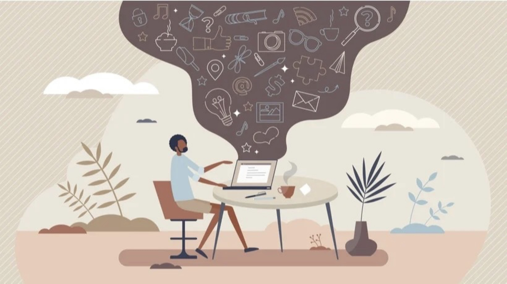

ENGL 334-001 / MW 13:00-14:15 / HLG 321

Pr. John Laudun / HLG 356 / <laudun@louisiana.edu>

# Description

Digital storytelling uses all the possibilities of digital media ---
text, images, audio, video --- to communicate effectively and, most
importantly, meaningfully with audiences. It combines the art of
traditional storytelling with the tools of modern technology, allowing
individuals to share their experiences and ideas with a wider audience.
While a lot of materials and tutorials focus on the technology, in this
course we will focus on what matters, the story. What makes for a good
story? How do stories work? What can we learn from thousands of years of
storytelling, and how can we adapt all these things we know about how
our brains work and how ideas are embedded in texts in order to tell a
story that our audience cannot stop listening to, reading, watching,
playing, experiencing?

This course explores all the fundamentals of storytelling and surveys
some of the varieties of media production (e.g., micro-blogging, long
form writing, audio, video, games). By the course's end, students have
designed and produced a variety of stories and published them on sites
of their choosing and design. Course features include guest lectures
(including storytellers), exploration of generative text AI, as well as
the usual readings and viewings that make up a university course.

# Objectives

In taking this course, participants will become familiar with the basic
structures of narrative (both cognitive and formal) and have some
experience in using those structures, or their knowledge of them, to
produce meaningful texts of their own. Participants will also explore
publishing options and will pursue at least a few of those options. More
particularly, this course makes it possible for participants to:

-   Develop a deeper sense of why we create and value stories and how
    communication technologies affect our ideas of narrative.

-   Create an online presence that you will use both to publish your
    stories but also to narrate your process as a creative practitioner
    and network with a community of peers to support your growth.

-   Explore a variety of digital technologies for the explicit purpose
    of employing them to create various narrative forms.

# Readings & Supplies

The readings in so far as it is possible will be available online. There
may be a book or two to purchase, but they will not be textbooks (and
come with textbook prices). Course participants will need to have a
smart phone, or a similar way of capturing audio and video, and a
computer on which to read, write, and edit. (The university licenses
Microsoft Office for you, and your computer should be able to run the
lightweight video editing software that comes with most computers these
days and audio editing software like Audacity.) Participants will also
need pen or pencil and paper (looseleaf or pad). Bring these to every
meeting. Leave your phone and your computer in your bag or pack unless
otherwise instructed. (See The Fine Print below for more about
notetaking.)

# Requirements

The course assumes that participants are self-motivated and willing to
experiment, and to fail. Failing at something is success. Failing to try
is failure. If you do not understand an assignment, ask. Ask a peer or
ask me. There are a lot moving parts to this course: publishing in some
fashion on the web, writing, making audio, making video, sketching out a
game. With today's smart phones and computers, you have access to all
the hardware and software you need to do not only basic but also
outstanding work. The only limitation is your willingness to try, to
take a risk.

That noted, this course is built around participants producing things.
We can call those things texts, and they can take the form of written
stories, or they can be realized in audio, video, dramatic presentation,
scripted interactive game play (either live or through a board or video
game).

By the end of the semester, you will have published at least ten such
productions. From those ten, you will select the five best as your
portfolio to be assessed by me (and perhaps your peers --- we'll see how
that goes). The portfolio must contain at least three written texts and
two non-written productions (audio, video, game, mystery). \[Please note
that any and all mysteries must be approved by my in advance of
portfolio submission.\]

**Participation** (70%) includes being active in class (20%) and doing
in-class assignments and submitting out-of-class assignments on time
(the other 50%).

**Portfolio** (30%) includes the five productions described above along
with a cover essay in which you state your understanding of stories and
storytelling and explain how your portfolio either exemplifies that
vision or fails to do so. (That is, you can be disappointed in your
portfolio and still do well: this is a university class; it's about
learning.)

To make assembling your portfolios and writing your portfolio statement
more clear, here is a description of how I will be approaching assigning
portfolio grades. That is, here's a rubric:

**Sub-par portfolios** simply throw five outputs together with little to
no revision and little to no thought of how they either fit together or
how they demonstrate a diversity of approaches. The portfolio statement
offers no synthesis of the outputs---indeed it references seldom or not
at all---and its vision of storytelling is hackneyed, paying little
attention to the elements of narrative discussed early in the course nor
to any of the other course materials.

**Average portfolios** have some sense of why these five outputs are
chosen, but it isn't terribly clear to the audience. The portfolio
statement offers some clarification, but the synthesis wanders through a
series of claims, none of which reference either the documents in the
portfolio nor any of the course materials.

**Remarkable portfolios** have five outputs that clearly either belong
together or clearly represent a diversity of storytelling options. This
clarity is reinforced by a portfolio statement that offers a clear sense
of what the producer thinks storytelling is about and that sense is made
clear by referencs to course materials and to moments in the portfolio
itself.

Careful readers of these descriptions will note that the portfolio
statement should offer something like a thesis as well as something like
evidence for any claim(s) made in the form of references to course
materials, including lectures and discussions, and portfolio items. Does
this mean you can quote yourself? Yes, it does, but do it well and with
a purpose.

For more about expectations, see *The Fine Print* below.

# Schedule

### unit 1

#### Week 1: What it's all about

All the usual things on the first day, including some participant
interaction focused on defining things like "stories" and "narrative."
Homework includes determining the venue for the course (e.g., GitHub
pages, Medium, etc.). **Read** for Wednesday: "The Most Dangerous Game."

#### Week 2: Themes & Variations

Everyone loves a good mystery.

#### Week 3: Why tell stories?

With introductions, warm-ups, and even a break behind us, we push for
real with a consideration of how storytelling currently figures in the
"marketplace of ideas." What are people saying? Why do they care? How
does this affect what you want to be able to do? **Read** Arguelles and
**watch** the video at the end of the essay. Then **read** "Genius
Storytelling Examples" and **watch** the Sagmeister video.

Arguelles, Carlos. 2021. The Importance of Story-Telling in Software
Engineering: Amazon's Cult of the 6-pager: why narrative matters. *Geek
Culture*, Nov 23.
<https://medium.com/geekculture/the-importance-of-story-telling-in-software-engineering-99004efda25f>.

-   [8 Genius Digital Storytelling
    Examples](https://www.brafton.com/blog/creation/mastering-digital-storytelling-in-2018/)

-   [You are not a storyteller - Stefan Sagmeister @
    FITC](https://vimeo.com/98368484)

#### Week 4 (S18/20): What is a narrative?

We begin the week with a focused consideration of the four dimensions of
narrative. **Read** Herman. We then proceed to apply Herman's rubric,
for lack of a better word, to a series of examples. **Homework**:
everyone is responsible for bringing in a text that challenges our
abilities to discern whether, what, how it is a narrative.

#### Week 5: The Shape(s) of Story

The beginning, middle, and end. Freitag's pyramid. The hero's journey,
Dan Harmon's story circle, Kurt Vonnegut's "man in the hole." So many
shapes? What do they tell us about stories? What can we learn from the
efforts of others to take a thing which represents events unfolding
across time by unfolding across time and making it unto a shape,
something time does not have? (Unless you're talking about the fabric of
space-time, in which case I need you to explain gravity to me one more
time....)

There's a lot here to take in, so brace yourself:

Read MasterClass' "How to Write Story Plot: Tips, Tricks, and Margaret
Atwood's Writing Prompts"
([URL](https://www.masterclass.com/articles/everything-you-need-to-know-about-writing-plot)).

#### Week 6

**Read**: Labov and Waletzky 1967. **Assignment**:

1.  Write a story about a traumatic event that happened in your life.

2.  Markup the worksheets on free and narrative clauses.

3.  Re-write your story on a separate piece of paper as a series of
    clauses. Number the clauses and then mark each one as *free* or
    *narrative*, being sure to indicate where the narrative conjunction
    occurs.

4.  Divide the number of narrative clauses by the total number of
    clauses and report that number to the board.

5.  Lecture on temporality and particularity.

In the next class meeting, we will hand back sheets and let people
compare. What changed? What did not? Collect both sets afterwards.

#### Week 7

This week is all about participants performing the stories with the text
of the story behind them. At 13:20, class will be interrupted by the
test of the EBS.

#### Week 8

Over the next three class meetings, we are going to take a deep dive
into traditional storytelling and stories. We are going to watch three
documentaries. The first two are broadly focused on the folk culture of
a particular area but feature stories and storytelling and the last of
which is focused particularly on stories and storytelling. We will start
the furthest away, with a film about Appalachian folk culture, then take
a step towards Louisiana with a film about African American folk culture
in the Deep South --- it was shot in Mississippi but much of it applies
to Louisiana --- and then we will end with a documentary about
\"swapping stories\" in Louisiana.

For each documentary, I expect you to take notes on the stories and
their tellers: who tells what tale, what is that tale about, and how
does the telling shape your understanding of the tale. (E.g., you are
going to watch a man tell a story about life in prison in the shadow of
a boat drydocked on the Mississippi River levee. He is surrounded by
other who understand what it means always to be on the wrong side of the
law.)

In addition to the documentaries, I will upload here audio recordings
for you to listen to. They will be accompanied by transcripts. Listen to
the story. Break it into pieces of scenes and of clauses. Think about
how it\'s put together and what you could learn from it about how to put
a story together. Bring the transcripts and your notes to each class
meeting.

When we meet, we will focus on lessons learned and key takeaways. At the
end of this unit, I am gong to ask you to write a story of your own
imagining. )The nature of that assignment will be revealed when the time
is right.)

*Appalachian Journey*:
https://www.folkstreams.net/films/appalachian-journey

*The Land Where the Blues Began*:

*Swapping Stories*:

Watch *Appalachian Journey*, taking special note of the storytelling
performances that occur within the documentary. Listen to Ray Hicks
perform "Jack and the Fire Dragon." Print the transcript and bring it to
class. <https://www.folkstreams.net/films/appalachian-journey>

**Watch** *Blues from the Delta*, again taking special note of the
storytelling performances and the stories told. Listen to Oscar
Babineaux performances. Print transcripts and bring them to class. Link:
<https://www.folkstreams.net/films/land-where-the-blues-began>.

**Watch** *Swapping Stories*. Link:
<https://www.folkstreams.net/films/swapping-stories>.

#### Week 9

Take a true story that you regularly tell or that you have heard told
--- by a friend, family member, someone at work, someone in a class ---
and revise it to include one unreal element that either strengthens the
story\'s original meaning or transforms it. The story itself can be
anywhere from 350-700 words (it can go longer but make sure you have a
good reason for it going longer). A supplement to the story should make
clear why you chose that particular unreal element and how it is
intended to work. Print two copies of the story (double-sided) and bring
them to class. Print the supplement separately and bring it as well.
Hand in a copy of the story and the supplement at the start of class.

Take a story you have heard about campus or an issue you have with
campus and turn it into a just-so story, legend, or tall tale. The story
must address a dimension of campus that others have experienced and can
go experience for themselves --- we want them to be able to test the
\"truth\" of your story. This does not mean that, should you write a
story that includes the fact demons possess the elevators in Griffin
that your audience must be able to go see demons, only that they might
find themselves wondering if there are gremlins (or whatever) causing
the elevator to make that noise and heave to a stop between floors.
 That is, can you write a story that changes the way people see things?
That makes them want to do something? One obvious caveat is that the
story must not suggest anything dangerous. (350-700 words)

#### Week 10

Choose a podcast or audiobook that features storytelling in some
capacity and then choose a story from within that production to discuss.
In your discussion of that story, establish its context within the
larger work: what is the larger work about? How often do stories
feature? What are the stories usually like? In addition to such textual
matters, also pay attention in your discussion to production matters:
what is the nature of the voice recording? (Is it in a live performance
with other sounds or is it a studio production?) Are there added
elements? (For example, do the producers of the text add in sound
effects or a musical score?) How do these elements add to the overall
affect of the story being told and/or to how stories are told in general
in the production? Add information for your analysis to the class slide
deck Audio Productions under the Files tab.

#### Week 12

Create a video in which you tell a story. You have a couple of options:

1.  **You telling a story directly into the camera**. All of the
    software you need is on your phone. What you have to be mindful of
    is lighting, sound, and shot composition. (Fortunately, when it
    comes to editing, jump cuts are an accepted way to put things
    together.) Begin with your story as well as your preferred way to
    produce a video. You have a number of options here: the *walk and
    talk* that emphasizes the journey you are taking your audience on,
    the *first person perspective* that allows you to limit your
    appearance in the video to your hands, and the *confidential* that
    has you go "face to face" with your audience are three of a wide
    variety of well-established tropes when producing videos of this
    kind. Whatever one you choose, be sure to record what filmmakers
    call "B roll." The A roll is the main for a video. Usually it has
    the audio to which you are going to cut everything else. B roll is
    supplemental video you have recorded, so that when you mention a
    pencil you can show your audience a pencil. From experience, you can
    never have enough B roll: shoot twice as much as you think you might
    need and you may have just enough.

2.  **You telling a story while edited video of some kind** (from other
    videos, stock video, animated images (like zooming or panning of
    photographs and drawings) or images you animate (like puppets or
    *SouthPark*). You could also use video captured from a game like
    *Mindcraft* or *Sims*: this kind of machinima was quite popular for
    a while, with *Red vs Blue* running for I don't know how many
    series.

3.  **Other people telling your stories** either directly addressing the
    camera, like 1 above, or by acting it out---this in itself could
    take the form of a "table read" or some protean form of acting.

Your finished video should be 3--5 minutes long---but, please, no longer
than 8 minutes.

#### Week 13

Create a scene from an interactive game in which your audience chooses
from a series of options (please go at least three deep). You can use
PowerPoint to do this and either walk us through the branching story, as
they are called, with notes like "If you choose X, go to Slide Y" or you
can use PowerPoint's built-in interactive functionality to make it
possible for your audience to play your game for themselves. Imagine you
are pitching your game to a game studio: give us the larger framework
(no more than 30 seconds and/or no more than a slide or two) but be sure
to drop us into the scene as quickly as possible.

# The Fine Print

**Attendance**. Active participation is a baseline expectation for this
course. However, given the endless pandemic circumstances, I expect
everyone to consider their own health and safety *as well as the health
and safety of others*. Do not come to campus if you have reason to
suspect you've been exposed to coronavirus or exhibit symptoms. If you
need to miss class, stay in touch with me by Teams so we can figure out
a plan to ensure you finish the semester successfully. Absence does not
justify turning in assignments late. *Above all, stay in touch.*

**Make-Up Work**. Work may be made up on a case-by-case basis.
Arrangements must be made in person before assignment due dates.

**Communication**. Almost everything will go through Teams. In fact, if
you wish to reach me individually, I also suggest using Teams. You are
responsible for checking Teams on a regular basis to stay up-to-date.
You should confirm any important oral communication by Teams, and if it
was an announcement made to the class, then doing so in the group
channel is doing a favor for all of us (including me!). If you need to
contact me by email, please remember to do so in a professional manner.
(I encourage a certain amount of informality in Teams because it helps
to lower the threshold for what can otherwise feel awkward, but do
remember that the internet is still the internet.)

**Notetaking** by hand is one of the greatest skills you can cultivate.
I have noted
[elsewhere](https://medium.com/@johnlaudun/why-i-wrote-notes-by-hand-and-you-should-too-492b0377db6a)
why I take notes by hand, and since then the evidence has only increased
that part of what we lose with our devices is the ability to be
creative. The added advantage of taking notes by hand is that they are
your notes; they are private by default; and they don't require
batteries to access. Consider your notes the place where you cultivate
your ideas and then the digital realm where you publish.

**A device-free meeting space**. The bargain I will make with you for
keeping your devices in your bags and packs is that our class meetings
will only ever last as long as they need to and no longer. My goal is to
make our meetings not simply "sage on a stage" but a place where we
talk, work, and, yes, write. (As we get better at writing without
devices, devices will start being allowed. Ironic, isn't it?)

**Academic Integrity**. The University considers both cheating and
plagiarism serious offenses. The minimum penalty for a student
responsible of either dishonest act is a grade of "zero" for the
assignment in question. The maximum penalty is dismissal from the
University. The complete policy may be found in the UL Lafayette
catalog.

**ChatGPT**. The University does not have a policy on the use of large
language model text generators like ChatGPT. I actively research ChatGPT
and other generative transformers, and I have a pretty good
understanding of how they work and what results they produce. While such
tools can assist writers, they are not a replacement for your own
creativity, originality, or critical thinking. Writing, like all crafts,
takes time and effort to develop. Writing assignments in this course
present an opportunity for you to develop your individual voice as a
writer and skills as a researcher. That said, within limited
circumstances, and with proper attribution, text generators may be used
as a tool. You must speak with me in advance before using them.

**Safety and Emergency**. A map of this floor is posted near the
elevator marking the evacuation route and Designated Rescue Area. This
is an area where emergency service personnel will go first to look for
individuals who need assistance in exiting the building.

**Reasonable Accommodation**. Disability Accommodations: Students
needing academic accommodations for a disability must first be
registered with the Office of Disability Services (ODS) to verify the
disability and to establish eligibility for accommodations. Students may
call 337-482-5252 or visit the ODS office in the Conference Center, room
126. Once registered, students should then schedule an appointment with
the professor to make appropriate arrangements.

**Discrimination and Harassment**. This class will not tolerate
discrimination on the basis of race, color, age, religion, national
origin, sexual orientation, sex, marital status, disability, or status
as a veteran. Alternative viewpoints are welcome; however, statements
that are deemed racist, sexist, homophobic, classist, or otherwise
discriminatory toward other participants, including the instructor, will
result in dismissal. Please be respectful and courteous in all
communication, be it written, oral, and/or nonverbal communication both
in and out of class.
