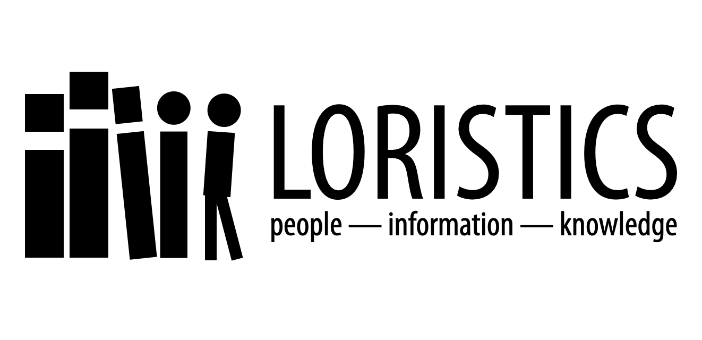

## Courses

* [Honors Academic Writing (115)](courses/115/index.md)
* [Introduction to Folk Narrative (332)](courses/332/index.md)
* [Digital Folklore and Culture (334)](courses/334-cultures/index.md)
* [Digital Storytelling (334)](courses/334-storytelling/index.md)
* [Louisiana Folklore (335)](courses/335/index.md) 
* [America in Legend Online and Off (432)](courses/432/index.md): 
* [Seminar in Narrative Studies (531)](courses/531/index.md)
* [Proseminar in Folklore Theory (632)](courses/632/index.md)

## Guides and Statements

There are some things all students in my courses need, or want, to know:

* Here's my list of [interview tips](guides/interview_tips.md).
* If you are not quite sure what a [literature review](guides/lit_review.md) is and you are in a course that requires one, here's a [basic guide](guides/lit_review.md).
* Revising and [editing](guides/editing.md) go hand-in-hand.
* Speaking of editing, having a [text editor](guides/editors.md) that works for you is a good idea.
* You may use any citation system, preferably the one used by your major, so long as you do so consistently and competently. In the absence of any other system, please feel free to use the one employed by social scientists and humanists around the world known as the [Chicago Author-Date System](guides/cad.md). (It's easier, and makes more sense, than MLA.)
* Navigating the library proxy when connecting to online databases when you are off campus, and understanding the relationship between the library's website and something like JSTOR can be confusing. [Here's some help](guides/access.md).
* [A (Kind of) Handbook on Writing](guides/writing.md) includes sections on how to think of sentences and paragraphs as building blocks, on introductory paragraphs, on how to write summaries, and how to write thesis statements. If you need help with writing, and almost all of us do, then seek it out. Find me, find the Writing Lab, find an experienced writer -- FTR, lawyers write a lot -- or search the web in general or Medium or Youtube in particular.
* There is a common set of guidelines/requirements on how to be a participant in a course I facilitate. Read [The Essentials](guides/essentials.md).
* For my writing-intensive courses, which is almost all of them, I prefer to use Google Drive. Please make sure you have an account and you know not only how to create and edit documents, but you are also familiar with the reviewing functionality, which Google calls *Suggesting*. Google for Education has produced a video on how to research and write a paper using Google Docs, which also has useful tips on how to take and organize notes: [Research and Writing](https://applieddigitalskills.withgoogle.com/c/college-and-continuing-education/en/research-and-writing/overview.html).
* If you don't know about [Open Culture][], then you should take a look. A variety of materials -- audio books, textbooks -- are available there. In particular, I regularly use their [archive of films][] for teaching.
* Interested in the quantitative / digital humanities but don’t know where to start? There’s a [page](guides/qh.md) for that.

[Open Culture]: http://www.openculture.com
[archive of films]: http://www.openculture.com/freemoviesonline

## Texts & TEI

There are a number of texts which are regularly useful:

- [AT 510](texts/AT_510.md): The Turkey Herder
- [AT 513](texts/AT_513.md): Ein bato ki té koné navigué on la terre com on la mer
- [Grimms 5](texts/grimms_05.md)
- [Grimms 91](texts/grimms_91.md)
- Ray Hicks' ["Jack and the Fire Dragaman"](texts/hicks_2.md)
- Kenneth Burke's ["Literature as Equipment for Living"](texts/Burke_1941.pdf)
- [27 Treasure Legends from Louisiana](texts/legends.md)

There are also a couple of TEI files: a [template](tei/template.tei) and an [example](tei/laudun-20000712-01.tei).

## Course Sketches for the Quantitative Humanities

The courses listed below are ones I imagine teaching in a context where both close and distant reading, where both computation and cogitation, feature equally in the treatment of texts.

* [Introduction to Text Analytics](courses/qh200/index.md)
* [What We Think When We Think about Machine Thinking](courses/qh300/index.md)
* [The Spread of (Mis)Information](courses/qh400/index.md)

While I have never taught these courses as they are sketched out here, they are based on units or features of courses or workshops I have alreday conducted and so I have the begun the process of building the blocks.

## Colophon

This site is designed to be available to course participants and interested others without having to negotiate LMS logins, or outages. It is built using Jekyll and is hosted in a [GitHub repository][]. 

While I try to make as much as possible available publicly, both for students in my courses as well as to interested others, some course materials must remain behind the university paywall (aka [Moodle][]) due to copyright restrictions. (I take fair use seriously.) If you are a visiting student or scholar and would like access to those materials, please get in touch with [me][].

In addition to this teaching site, I also maintain a personal [site][]. there is also an older WordPress [blog][], for those interested, which will at some point transition to the new GitHub Pages infrastructure. (Migrations are slow processes when you have a lot of materials.) 

As much as possible, most things on all my sites are released under the [Creative Commons Attribution-ShareAlike 4.0 International Code][cc] (CC BY-SA 4.0).

[GitHub repository]: https://github.com/johnlaudun/teaching
[Moodle]: https://moodle.louisiana.edu/
[me]: https://johnlaudun.net/contact.html
[site]: https://johnlaudun.net/
[blog]: https://johnlaudun.org/
[cc]: https://creativecommons.org/licenses/by-sa/4.0/
